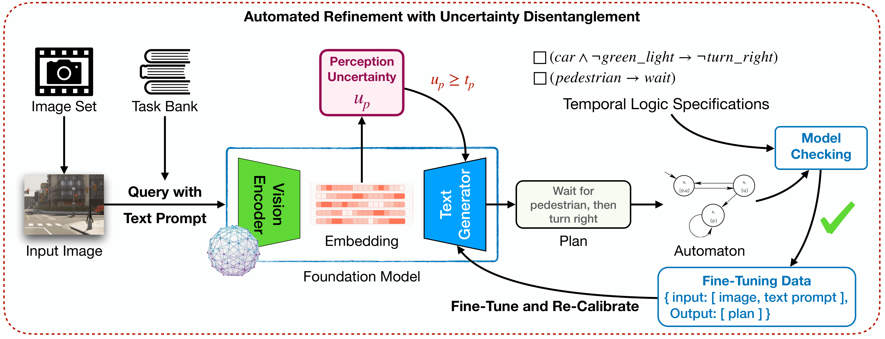

# Know Where You’re Uncertain When Planning with Multimodal Foundation Models: A Formal Framework

We presented a novel framework for enhancing multimodal foundation models in robotic planning by disentangling, quantifying, and addressing perception and decision uncertainties. By isolating perception uncertainty in visual interpretation and decision uncertainty in plan generation, our approach enables targeted uncertainty management.




## Setup
```bash
$ pip install openai==1.40.2
$ pip install openai-clip==1.0.1
$ pip install seaborn
$ pip install pandas
$ pip install torch==2.2.2
$ pip install torchvision==0.17.2
```

## Example Notebooks
1. Disentangling and quantifying perception and decision uncertainty [here](uncertainty-quantification.ipynb).
2. Inference on our fine-tuned multimodal foundation model and comparison with benchmark [here](fine-tuned-model-inference.ipynb).

## Model Checkpoints
All model checkpoints are available on huggingface [here](https://huggingface.co/anonymous-yyh-1971).

## Datasets
### Calibration
1. [Carla Images](https://drive.google.com/drive/folders/1Nqp6psvKPDkaTVC5UEfwR1N-c76qv61o?usp=sharing)
2. [Table-Top Manipulation (Robot Arm's View and Top View)](https://drive.google.com/drive/folders/1Q8oNpAawJZmGR3u9g2gmIVVpLsN7W1aM?usp=sharing)
3. [Table-Top Manipulation (Side View)](https://drive.google.com/drive/folders/17HsMV-YMzkFRAB9NQ6LoDPnEwaIiTgYV?usp=sharing)

### Training
[Carla Images](https://drive.google.com/drive/folders/1j34A-vWG0oMdAjfCZDZIaKHr4AeZ5iPU?usp=sharing)

### Testing
[Real-World Driving](https://drive.google.com/drive/folders/1Pg5c4Gp6KF7n0Oy22gaz9gXYh8TPuIBJ?usp=sharing)

### Sample Images for Inference
[Inference Samples](https://huggingface.co/datasets/anonymous-yyh-1971/hf_dataset/tree/main)
